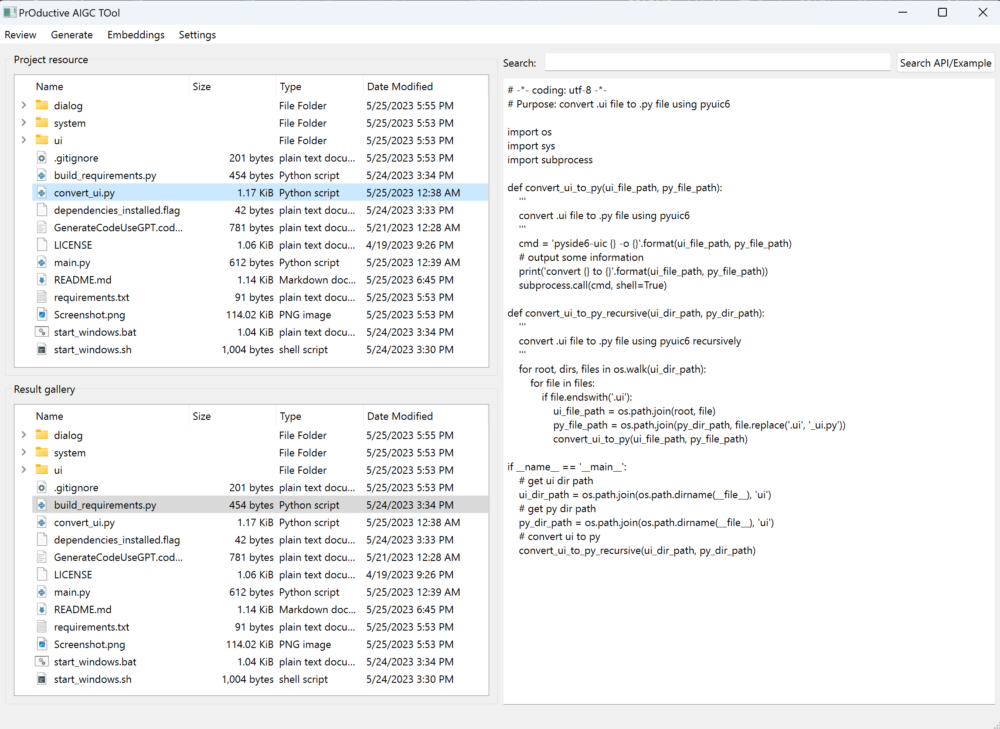
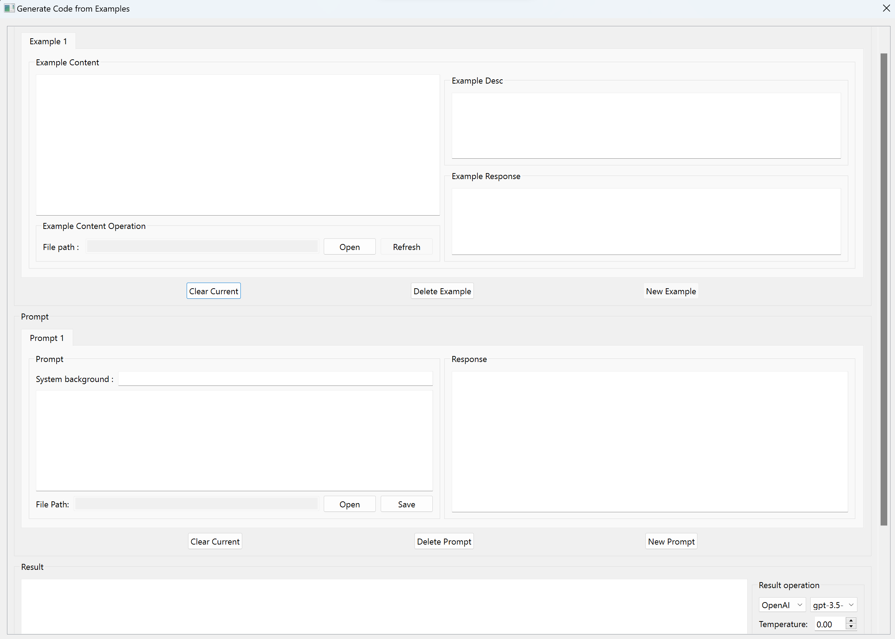

# 利用OpenAI或者Google的LLM模型来审核和生成代码或者文字

[English Edition](README.md)

[日本語版 クリックしてください](README.jp.md)

## 概述

这个仓库包含一些提升效率的生产工具。

1. 使用 OpenAI/Google LLM 模型审查代码或文本。
2. 使用 OpenAI/Google LLM 模型生成代码或文本。
3. 搜索项目文档API，生成如何使用自己项目的API的例子。
...
更多工具正在开发中。

这个工具是用python3编写的，使用PySide6作为GUI基础模块。

概览图：

## 手把手生成代码步骤

1. 在windows双击start_windows.bat或在linux上执行start_windows.sh
2. .bat或.sh文件将使用pip安装所需的模块，然后启动gui。如果您没有安装python3或pip，您可以从[python.org](https://www.python.org/downloads/)安装。
3. 第一次看到图形用户界面时，会出现一个设置对话框，如下所示：
   设置面板说明：
     - Project Root Dir：设置项目的根目录路径，方便查找api和生成代码的example。 在您实际使用OpenAI api或者Google api生成代码或文本之前，您的代码或文本不会上传。
     - Result Json Dir：设置生成的代码或文本的保存目录路径。结果文件将保存所有可以生成结果的信息，包括提示、示例、模型、温度、生成的代码或文本等。
     - OpenAI api-key：设置OpenAI API密钥。您可以从[OpenAI](https://platform.openai.com/account/api-keys) 获取它。
     - Google PaLM api-key：设置Google PaLM密钥。您可以从 [Google](https://makersuite.google.com/app/apikey) 获取它。
4. 设置成功后，就可以开始生成代码或文本了。 单击主窗口上的“Generate”菜单，然后单击“Generate with Examples”菜单项。 面板如下图： 
   生成面板说明：
     - 生成面板中有 3 个部分。
     - 第一部分是示例部分。 您可以添加多个示例代码或文本。 示例将在未来由 AI 模型自动选择。
     - 第二部分是提示部分。 您可以在此处输入提示。 您可以添加一个提示选项卡，并将 AI 模型的先前响应放在这里以生成下一个响应，就像一个连续的对话。
     - 第三部分是生成部分。 您可以选择要使用的型号、要设置的温度值等。然后单击“生成”按钮生成代码或文本。
5. 您可以通过点击“保存”按钮保存您的生成结果并分享给其他人。
6. 您可以通过单击“加载”按钮来加载生成的结果。
