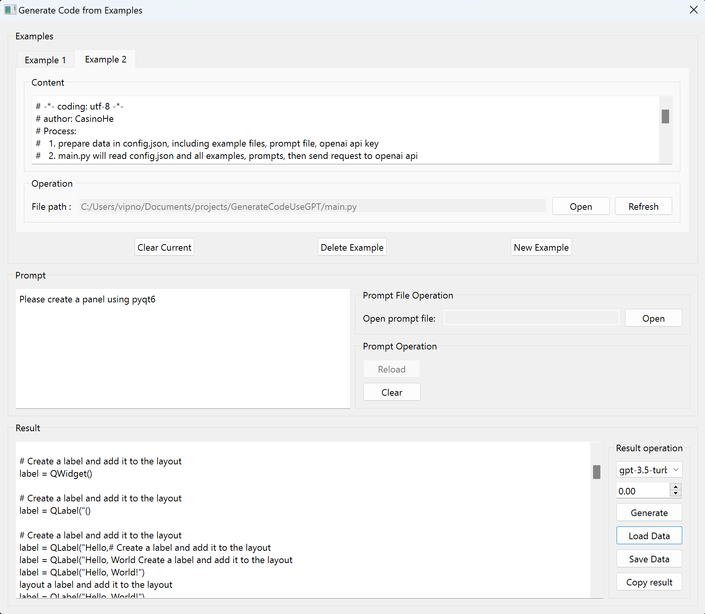

# Generate code using openai Models

## overview

This repository contains a tool to generate code using openai api-key.
This tool is written in python and use PyQt6 for the GUI.

First gui view:

## generate code step by step

1. open the example code file, the code will display in the text editor
2. if you want to change the code, you can edit the code in the text editor
3. if you have more than one example code, you can click the 'New Example' button, and add more examples
4. input the prompt in the prompt text editor
5. choose the models you want to use, for example 'davinci', 'gpt-3.5-turbo'
6. choose the temperature, the higher the temperature, the more random the result
7. generate the code by clicking the 'Generate' button
8. You can save your examples and prompt by clicking the 'Save' button
9. You can load your examples and prompt by clicking the 'Load' button