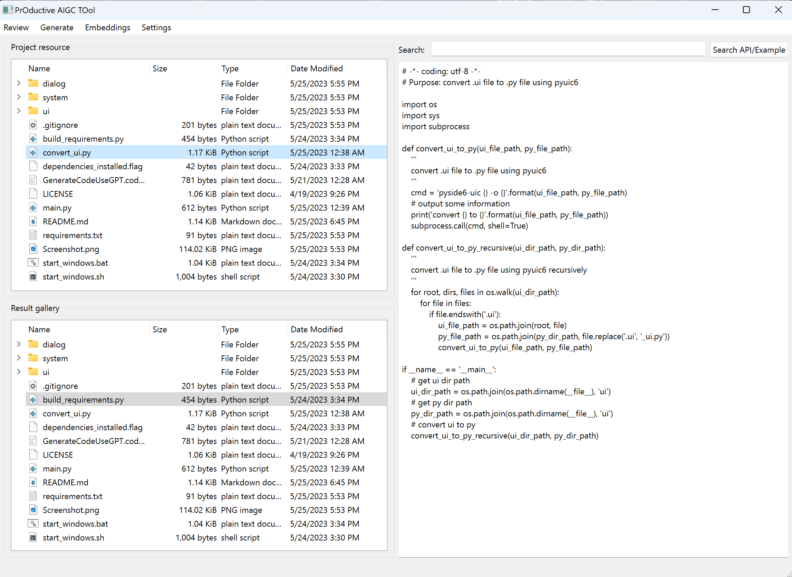

# Generate and Review code or text using OpenAI or Google LLM Models

[中文版请点击](README.cn.md)

[日本語版 クリックしてください](README.jp.md)

## overview

This repository contains some productive tools.

1. Review code or text using OpenAI/Google LLM models.
2. Generate code or text using OpenAI/Google LLM models.
3. Search API, generate samples of your own project for how to using API.
...
More tools are under development.

This tool is written in python and use PySide6 as the GUI base module.

First gui view:

## generate code step by step

1. Double click the start_windows.bat on windows or start_windows.sh on linux
2. The .bat or .sh file will install the required modules using pip and then start the gui. If you don't have python3 or pip, you can install it from [python.org](https://www.python.org/downloads/)
3. Once you see the gui for the first time, a settings dialog will appear as shown below: 
  Settings panel explaination:
    - Project Root Dir: Set the root directory path of your project, which is convenient for searching api and finding example for generating code. Your code or text will not be uploaded to OpenAI's api or Google's API until you generate the code or text using them actually.
    - Result Json Dir: Set the save directory path of the genereted code or text. The result file will save all information that can generate the result, including the prompt, the example, the model, the temperature, the generated code or text, etc.
    - OpenAI api-key: Set the OpenAI API Key. You can get it from [OpenAI](https://platform.openai.com/account/api-keys).
    - Google PaLM api-key: Set the Google PaLM Key. You can get it from [Google](https://makersuite.google.com/app/apikey).
4. After the setup is successful, you can start generating code or text. Click the 'Generate' menu on main windows, then click the 'Generate from example' menu item. The panel shown as below: 
  Generate panel explaination:
    - There are 3 sections in the generate panel.
    - The first section is the example section. You can add more than one example code or text. The examples will be automatically selected by the AI model in the future.
    - The second section is the prompt section. You can input the prompt here. You can add a prompt tab and put the previous response from the AI model here to generate the next response, like a continuous conversation.
    - The third section is the generate section. You can choose the models you want to use, the temperature value you want to set, etc. Then click the 'Generate' button to generate the code or text.
5. You can save your generate result by clicking the 'Save' button and share to others.
6. You can load your generate result by clicking the 'Load' button
