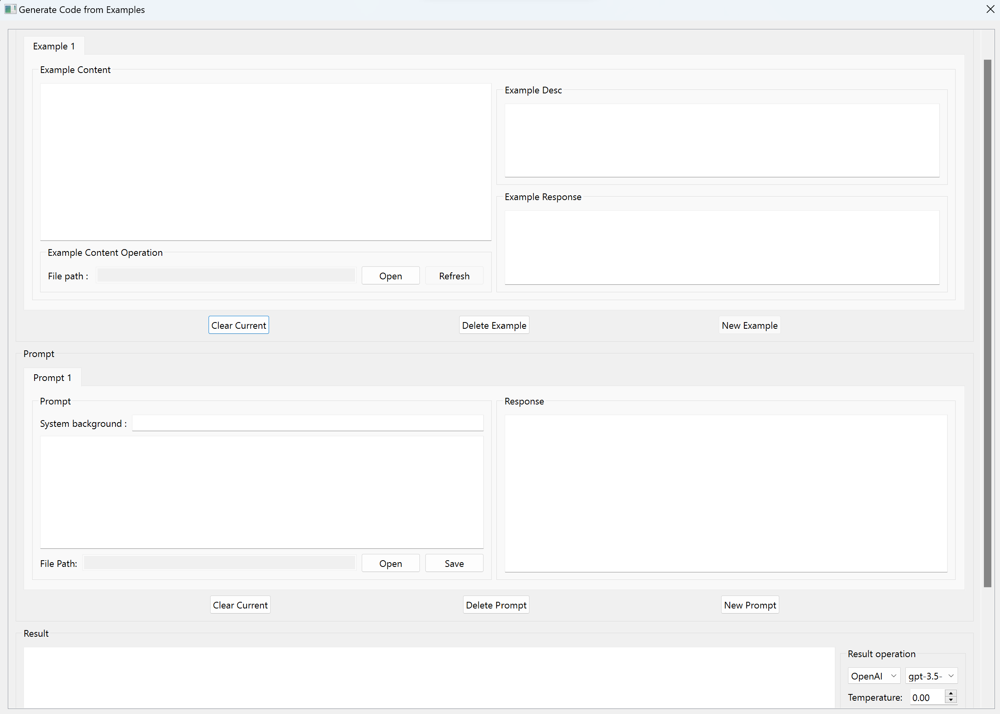

# OpenAI または Google LLM モデルを使用してコードまたはテキストを生成およびレビューする

[English Edition](README.md)

[中文版请点击](README.cn.md)

## 概要

このリポジトリには、いくつかの生産的なツールが含まれています。

1. OpenAI/Google LLM モデルを使用してコードまたはテキストをレビューします。
2. OpenAI/Google LLM モデルを使用してコードまたはテキストを生成します。
3. API を検索し、API の使用方法について独自のプロジェクトのサンプルを生成します。
...
さらに多くのツールが開発中です。

このツールは Python で書かれており、GUI ベース モジュールとして PySide6 を使用します。

最初の GUI ビュー:

## コードを段階的に生成します

1. Windows の場合は start_windows.bat を、Linux の場合は start_windows.sh をダブルクリックします
2. .bat または .sh ファイルは、pip を使用して必要なモジュールをインストールし、GUI を起動します。 python3 または pip をお持ちでない場合は、[python.org](https://www.python.org/downloads/) からインストールできます。
3. GUI を初めて表示すると、以下に示すような設定ダイアログが表示されます: 
   設定パネルの説明:
     - プロジェクト ルート ディレクトリ: プロジェクトのルート ディレクトリ パスを設定します。これは、API の検索やコード生成のサンプルの検索に便利です。 実際にコードやテキストを使用して生成するまで、コードやテキストは OpenAI の API や Google の API にアップロードされません。
     - Result Json Dir: 生成されたコードまたはテキストの保存ディレクトリのパスを設定します。 結果ファイルには、プロンプト、例、モデル、温度、生成されたコードまたはテキストなど、結果を生成できるすべての情報が保存されます。
     - OpenAI APIキー: OpenAI APIキーを設定します。 [OpenAI](https://platform.openai.com/account/api-keys) から入手できます。
     - Google PaLM API-key: Google PaLM キーを設定します。 [Google](https://makersuite.google.com/app/apikey) から入手できます。
4. セットアップが成功したら、コードまたはテキストの生成を開始できます。 メイン ウィンドウで [生成] メニューをクリックし、[例から生成] メニュー項目をクリックします。 以下に示すパネル: 
   パネルの説明を生成します。
     - 生成パネルには 3 つのセクションがあります。
     - 最初のセクションはサンプルセクションです。 複数のサンプルコードまたはテキストを追加できます。 サンプルは将来的に AI モデルによって自動的に選択される予定です。
     - 2 番目のセクションはプロンプトセクションです。 ここにプロンプトを入力できます。 プロンプト タブを追加し、AI モデルからの前の応答をここに配置して、継続的な会話のように次の応答を生成できます。
     - 3 番目のセクションは生成セクションです。 使用したいモデル、設定したい温度値などを選択できます。次に、「生成」ボタンをクリックしてコードまたはテキストを生成します。
5. [保存] ボタンをクリックして生成結果を保存し、他の人と共有することができます。
6. 「ロード」ボタンをクリックすると、生成結果をロードできます。
